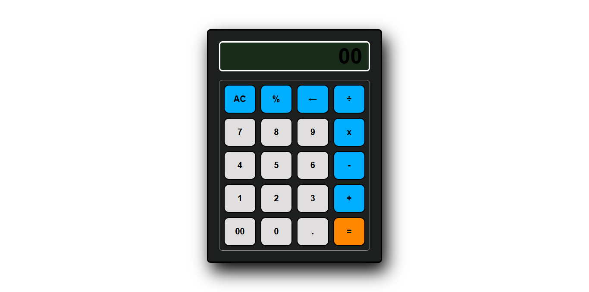

# Simple-Calculator - Minimalist Web Calculator



A clean, responsive calculator built with pure HTML, CSS, and JavaScript.

## Features

- **Basic Operations**: +, -, ×, ÷
- **Advanced Functions**: %, backspace
- **Responsive Design**: Works on all devices
- **Keyboard Support**: Type calculations naturally
- **Smart Display**: Auto-adjusting font size
- **Error Handling**: Catches invalid inputs

## Technologies

- **HTML5**: Semantic structure
- **CSS3**: Flexbox/Grid layout, transitions
- **JavaScript**: Core calculation logic
- **Media Queries**: Mobile responsiveness

## Installation

```bash
git clone https://github.com/CodesByNitin/simple-calculator.git
cd simple-calculator
open index.html
